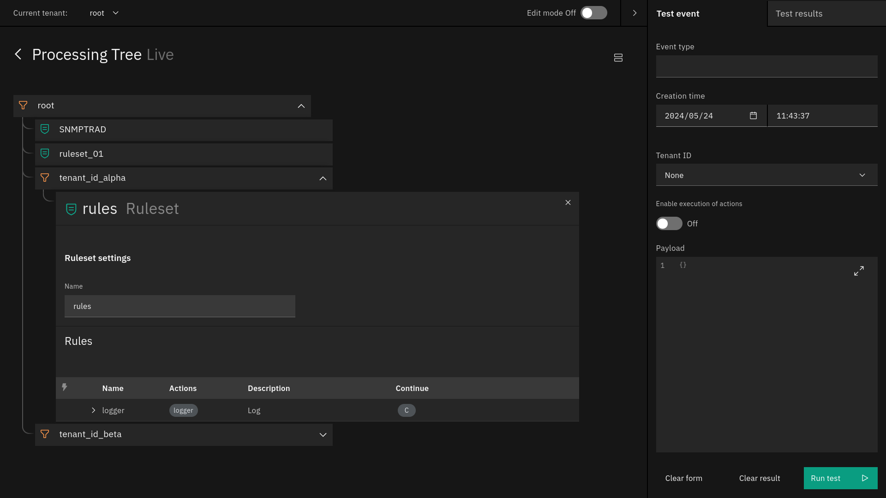

<div align="center">

# Tornado Web UI

**The configuration web view for the [Tornado Engine](https://github.com/WuerthPhoenix/tornado)**

This repo contains the code for the Web UI for the
[Tornado Event Processing Engine](https://github.com/WuerthPhoenix/tornado).
It builds on the [Carbon Design System](https://carbondesignsystem.com/) and
[Vue.js](https://vuejs.org/).

</div>


## Getting started

To get started with tornado, simply clone this repo and its submodules to your
local machine and then run the command `docker-compose up` in the base
directory. This will launch four docker container:

1. *tornado-wui_ui* contains an nginx instance that serves the actual web ui
2. *tornado-wui_backend-user* contains a mock for the user backend containing:
    1. User preferences
    2. Translations
3. *tornado-wui_backend-tornado* contains a tornado instance which provides
    the configuration and handles the events.
4. *tornado-wui_proxy* contains a nginx proxy that forwards all the requests
    to the right container and adds the auth headers for tornado.

After the containers have been build and were started, the UI will be available
at http://localhost:8080




## Testing out the UI

To quickly get a feel for the behaviour, try running an example in the test
window. For that, simply copy the following JSON object into the payload in the
test window:

``` json
{
  "type": "foreach_log",
  "created_ms": 1716543817000,
  "payload": {
    "source": "test-event",
    "values": [
      "log one",
      "log two",
      "log three"
    ]
  },
  "metadata": {
    "tenant_id": "beta"
  }
}
```

Don't forget to enable the execution of actions. With this you can see how data
will flow through the processing tree.


## Authentication and Authorization

The Tornado backend does not handle authentication on its own as it is meant to
integrate into a broader system. Instead tornado is expected to run behind a
proxy, which will handle the Authentication and set the necessary Authorization
header before forwarding the request to tornado.


<!-- ToDo: Replace next with current after the release of neteye 4.36 -->
To learn more about the Auth header, please refer to [the API reference](https://neteye.guide/next/monitoring/tornado/advanced-topics/api-reference.html)

**Warning:** In this repo, the authorization backend is mocked, by giving root
privileges to all users.  


## User info and Translation

In the same spirit as with the auth, the tornado frontend does not handle user
info and translations on its own. Instead it makes requests to the backend to
handle that instead. The necessary backend endpoints are implemented in the
`backend_user` directory. 

The file with all text to translate can be found in the path
[ui/src/assets/i18n/translations.json](https://github.com/WuerthPhoenix/tornado-wui/blob/master/ui/src/assets/i18n/translations.json)
